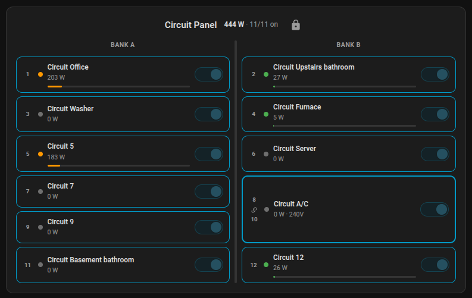

# Jackery Lovelace Cards

Custom Lovelace cards for the [Jackery Home Assistant Integration](https://github.com/turmacar/jackery-homeassistant).

> **Requires** the [Jackery integration](https://github.com/turmacar/jackery-homeassistant) to be installed and configured first.

## Cards

### Power Status Card (`jackery-power-status-card`)

A single-glance card combining solar input status with grid/battery input status, instead
of several disconnected native HA tiles.

**Features:**
- Solar panel input power and solar type/parallel-connection status (from a solar-capable
  portable device)
- Grid/battery status: power system state (Grid/Station), input/output power, battery %,
  working mode, backup reserve, UPS mode and force charge indicators
- Falls back to a portable device's own battery info if no Transfer Switch is present
- Auto-discovers both devices; either half degrades gracefully if its device is missing

### Transfer Switch Plan Card (`jackery-ts-plan-card`)

A custom card for managing charge/discharge plans on the Jackery Smart Transfer Switch.


**Features:**
- Create, edit, and delete charge/discharge plans directly from the HA UI
- Toggle individual plans on/off
- Toggle individual day-of-week scheduling per plan
- Drag-and-drop reordering (desktop and mobile)
- Organize plans with custom dividers
- Lock/unlock editing mode (default: locked)
- Cross-device persistence of plan order and lock state

### Circuit Panel Card (`jackery-circuit-panel`)

A breaker-panel style card for visualizing and controlling Transfer Switch circuits.



**Features:**
- Two-bank layout (Bank A / Bank B) matching physical breaker panel
- Combined split-phase (240V) circuits displayed as double-height breakers
- Real-time power monitoring with color-coded levels and progress bars
- Auto-discovers circuit entities or accepts manual `device_prefix` config
- Lock/unlock circuit controls (default: locked)
- Full-width layout in sections view
- Mobile responsive: stacks banks vertically on narrow screens

### Schedule Heatmap Card (`jackery-schedule-heatmap`)

A 7-day × 24-hour heatmap showing plan coverage at a glance.


**Features:**
- Half-hour resolution grid colored by plan type (green=charge, orange=discharge)
- Overlapping plans shown with striped pattern
- Current time marker
- Schedule overlays (e.g. peak/off-peak) from HA schedule helpers
- Auto-detects schedules by season via an `input_select` entity

## Installation

### HACS (Recommended)

1. Open HACS → Frontend
2. Click the three-dot menu → Custom repositories
3. Add `https://github.com/turmacar/jackery-lovelace-cards` as a **Lovelace** repository
4. Install **Jackery Lovelace Cards**
5. Restart Home Assistant

### Manual

1. Download card JS files from the [latest release](https://github.com/turmacar/jackery-lovelace-cards/releases)
2. Copy to `config/www/community/jackery/`
3. Add the resources in **Settings → Dashboards → Resources**:
   - URL: `/local/community/jackery/jackery-ts-plan-card.js` — Type: JavaScript Module
   - URL: `/local/community/jackery/jackery-circuit-panel.js` — Type: JavaScript Module
   - URL: `/local/community/jackery/jackery-schedule-heatmap.js` — Type: JavaScript Module
   - URL: `/local/community/jackery/jackery-power-status-card.js` — Type: JavaScript Module

## Configuration

All cards auto-discover entities if your device includes `transfer_switch` in the name. Use `entity` to override.

### Power Status Card

```yaml
type: custom:jackery-power-status-card
# title: Power Status                          # optional
# switch_device_prefix: basement_smart_transfer_switch  # optional, auto-discovered
# solar_device_prefix: explorer_5000                     # optional, auto-discovered
# solar_efficiency_entity: sensor.solar_efficiency        # optional, not auto-discovered (requires a weather-based helper, e.g. Tempest station that provides W/m^2 or similar) (the absolute best panels in the absolute best conditions max out around 20-30%)
```

### Transfer Switch Plan Card

```yaml
type: custom:jackery-ts-plan-card
# entity: sensor.jackery_<device>_scheduled_plans  # optional, auto-discovered
```

### Circuit Panel

```yaml
type: custom:jackery-circuit-panel
# entity: sensor.jackery_<device>_circuit_1_power  # optional, auto-discovered
```

### Schedule Heatmap

```yaml
type: custom:jackery-schedule-heatmap
# entity: sensor.jackery_<device>_scheduled_plans  # optional, auto-discovered
# title: Schedule Heatmap                          # optional
# show_plans: true                                 # optional, list active plans below grid
# season_entity: input_select.my_season            # optional, selects schedule overlays by season
# schedules:                                       # optional, explicit schedule overlays
#   - entity: schedule.on_peak_summer
#     label: On-Peak
#     color: "rgba(219, 68, 55, 0.25)"
#   - entity: schedule.morning_discount
#     label: Discount
#     color: "rgba(33, 150, 243, 0.25)"
```

## Prerequisites

- [Jackery Home Assistant Integration](https://github.com/turmacar/jackery-homeassistant) installed and configured
- A Jackery Smart Transfer Switch set up in the integration
