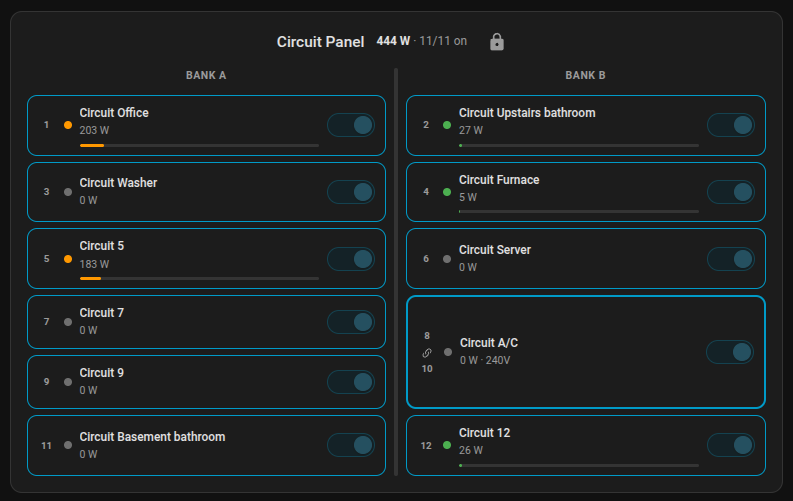

# Jackery Lovelace Cards

Custom Lovelace cards for the [Jackery Home Assistant Integration](https://github.com/turmacar/jackery-homeassistant).

> **Requires** the [Jackery integration](https://github.com/turmacar/jackery-homeassistant) to be installed and configured first.

## Cards

### Power Status Card (`jackery-power-status-card`)

A single-glance card combining solar input status with grid/battery input status, instead
of several disconnected native HA tiles.

**Features:**
- Solar panel input power and solar type/parallel-connection status (from a solar-capable
  portable device)
- Grid/battery status: power system state (Grid/Station), input/output power, battery %,
  working mode, backup reserve, UPS mode and force charge indicators
- Falls back to a portable device's own battery info if no Transfer Switch is present
- Auto-discovers both devices; either half degrades gracefully if its device is missing

### Portable Station Card (`jackery-portable-card`)

The portable counterpart to the Power Status card: a single-glance status and output-control
card for an Explorer-series portable power station.

**Features:**
- Battery %, charge/discharge status, level bar, and time-to-full / time-remaining
- Total input and output power, broken down by AC / DC / solar input and per-port output
  (only ports the device actually reports are shown)
- AC output voltage/frequency, battery temperature, parallel-connection status
- Toggle chips for AC / DC / USB / Car outputs and Super Fast Charge
- Mode chips for battery protection, charge speed, light mode, Transfer Switch connection
  and AC pass-through
- Alarm banner for temperature/power alarms and error codes
- Lock/unlock controls (default: locked)
- Resolves the device from the HA device registry (not entity-id naming), skipping Transfer
  Switches; override with `device` (device name or device id)

### Transfer Switch Plan Card (`jackery-ts-plan-card`)

A custom card for managing charge/discharge plans on the Jackery Smart Transfer Switch.


**Features:**
- Create, edit, and delete charge/discharge plans directly from the HA UI
- Toggle individual plans on/off
- Toggle individual day-of-week scheduling per plan
- Drag-and-drop reordering (desktop and mobile)
- Organize plans with custom dividers
- Lock/unlock editing mode (default: locked)
- Cross-device persistence of plan order and lock state

### Circuit Panel Card (`jackery-circuit-panel`)

A breaker-panel style card for visualizing and controlling Transfer Switch circuits.



**Features:**
- Two-bank layout (Bank A / Bank B) matching physical breaker panel
- Combined split-phase (240V) circuits displayed as double-height breakers
- Real-time power monitoring with color-coded levels and progress bars
- Auto-discovers circuit entities or accepts manual `device_prefix` config
- Lock/unlock circuit controls (default: locked)
- Full-width layout in sections view
- Mobile responsive: stacks banks vertically on narrow screens

### Schedule Heatmap Card (`jackery-schedule-heatmap`)

A 7-day × 24-hour heatmap showing plan coverage at a glance.


**Features:**
- Half-hour resolution grid colored by plan type (green=charge, orange=discharge)
- Overlapping plans shown with striped pattern
- Current time marker
- Schedule overlays (e.g. peak/off-peak) from HA schedule helpers
- Auto-detects schedules by season via an `input_select` entity

### Battery Pack Status Card (`jackery-battery-pack-card`)

Side-by-side AC1/AC2 battery slot display for the Smart Transfer Switch, with per-add-on-pack
detail.

**Features:**
- Battery %, input/output power, and charging status for each slot
- Per-slot solar input power (each device in AC1/AC2 can have its own solar array), shown
  separately from grid input/output
- Time-to-full (while charging) or time-remaining (while discharging)
- Add-on battery pack count and per-pack battery level chips (serial number on hover)
- Slots with no device connected show a "Not Connected" placeholder instead of blank data
- Auto-discovers the Transfer Switch device; either slot degrades gracefully

> **Known limitation:** The Transfer Switch's real-time MQTT push doesn't include the
> nested AC1/AC2 slot data. This card's numbers are only as fresh as the integration's
> ~60s HTTP poll cycle. Values lag up to a minute.

## Installation

### HACS (Recommended)

1. Open HACS, click the three-dot menu -> **Custom repositories**
2. Add `https://github.com/turmacar/jackery-lovelace-cards` as type **Dashboard**
3. Download **Jackery Lovelace Cards**, then reload the browser when prompted

HACS installs a single bundled file, `dist/jackery-lovelace-cards.js`, containing
all six cards. No manual resources or restart needed.

### Manual

1. Download [`dist/jackery-lovelace-cards.js`](https://github.com/turmacar/jackery-lovelace-cards/blob/main/dist/jackery-lovelace-cards.js)
2. Copy it to `config/www/community/jackery/`
3. Add one resource in **Settings -> Dashboards -> Resources**:
   - URL: `/local/community/jackery/jackery-lovelace-cards.js` - Type: JavaScript Module
4. After updating the file, bump a `?v=N` query on that URL so browsers fetch the new version.

Don't keep both installs: remove the manual resources before switching to HACS.

### Development

Edit the `jackery-*.js` sources in the repo root, then run `scripts/build.sh` to
regenerate `dist/jackery-lovelace-cards.js` and commit both. To release, bump
`VERSION`, rebuild, commit, push, then tag (e.g. `git tag 1.0.1 && git push origin 1.0.1`).
The release workflow fails if `VERSION` doesn't match the tag or `dist/` is stale.

## Configuration

All cards auto-discover entities if your device includes `transfer_switch` in the name. Use `entity` to override.

### Battery Pack Status Card

```yaml
type: custom:jackery-battery-pack-card
# title: Battery Packs             # optional
# device_prefix: basement_smart_transfer_switch  # optional, auto-discovered
```

### Power Status Card

```yaml
type: custom:jackery-power-status-card
# title: Power Status                          # optional
# switch_device_prefix: basement_smart_transfer_switch  # optional, auto-discovered
# solar_device_prefix: explorer_5000                     # optional, auto-discovered
# solar_efficiency_entity: sensor.solar_efficiency        # optional, not auto-discovered (requires a weather-based helper, e.g. Tempest station that provides W/m^2 or similar) (the absolute best panels in the absolute best conditions max out around 20-30%)
```

### Portable Station Card

```yaml
type: custom:jackery-portable-card
# title: Explorer 300 Plus          # optional, defaults to the device name
# device: Explorer 300 Plus         # optional, device name or device id; overrides auto-discovery
# device_prefix: explorer_300_plus  # optional, legacy entity-id prefix; overrides `device`
```

### Transfer Switch Plan Card

```yaml
type: custom:jackery-ts-plan-card
# entity: sensor.jackery_<device>_scheduled_plans  # optional, auto-discovered
```

### Circuit Panel

```yaml
type: custom:jackery-circuit-panel
# entity: sensor.jackery_<device>_circuit_1_power  # optional, auto-discovered
```

### Schedule Heatmap

```yaml
type: custom:jackery-schedule-heatmap
# entity: sensor.jackery_<device>_scheduled_plans  # optional, auto-discovered
# title: Schedule Heatmap                          # optional
# show_plans: true                                 # optional, list active plans below grid
# season_entity: input_select.my_season            # optional, selects schedule overlays by season
# schedules:                                       # optional, explicit schedule overlays
#   - entity: schedule.on_peak_summer
#     label: On-Peak
#     color: "rgba(219, 68, 55, 0.25)"
#   - entity: schedule.morning_discount
#     label: Discount
#     color: "rgba(33, 150, 243, 0.25)"
```

## Prerequisites

- [Jackery Home Assistant Integration](https://github.com/turmacar/jackery-homeassistant) installed and configured
- A Jackery Smart Transfer Switch set up in the integration
